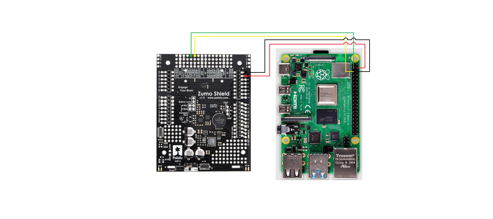

## Wire connection


You can check datasheet of Raspberry Pi 4 from [DataSheet](https://datasheets.raspberrypi.com/rpi4/raspberry-pi-4-datasheet.pdf).

**You can check the following steps using DataSheet.** 


| Pin | Wire Color |
|-----|------------|
| SDA | Green      |
| SCL | Yellow     |
| 5V  | Red        |
| GND | Black      |

> **Note:** These connections are only for the zumo shield 1.2 and raspberry pi 4 versions, if You have other versions please read the corresponding documentation before making the connections.
