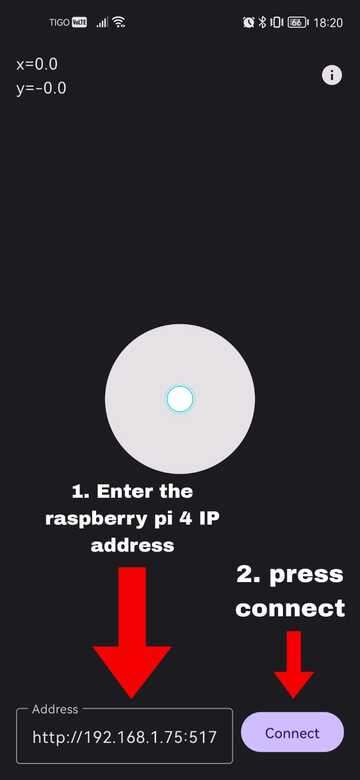


Download the APK following the next link: [APK](https://github.com/aldajo92/AndroidKt_JoyWebSocket/releases/download/1.0/JoyWebSocket.apk).


After installing the APK on your phone, connect using the Raspberry Pi 4 IP address or using the local hostname.

 

> **Note:** You can access the APK code through the following link: [APK documentation](https://github.com/aldajo92/AndroidKt_JoyWebSocket).