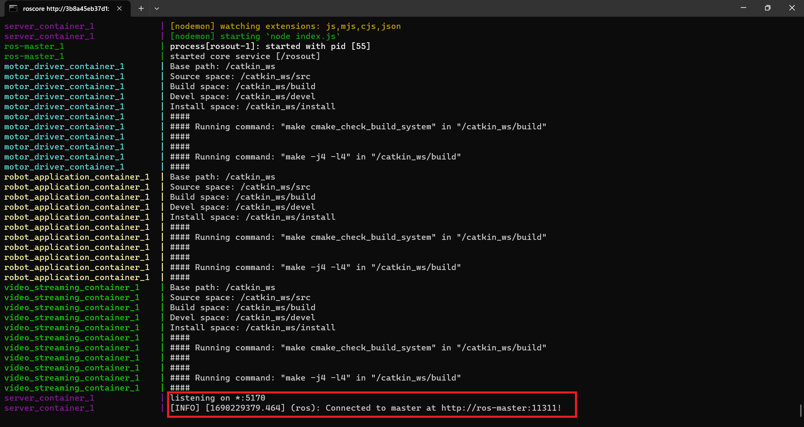


The code is be extracted from the [MardanRobotRpi](https://github.com/roboticamed/MardanRobotRpi) GitHub repository. 



### 1. Clone the repository

Clone the  [repository](https://github.com/roboticamed/MardanRobotRpi) on the Raspberry Pi using the following command:
```shell
sudo git clone https://github.com/roboticamed/MardanRobotRpi

```

### 2. Navigate to MardanRobotRpi

Once the repository is cloned, navigate to the **MardanRobotRpi** folder, and then enter on the **RPi** folder.
Please, follow the below commands:

``` shell
cd MardanRobotRpi/
cd RPi/
```

### 3. Run Docker Compose 

Run  Docker Compose in the directory ~/MardanRobotRpi/RPi.
```shell
docker-compose up
```
That should give an output similar to:



After establishing a connection with the master at **http://ros-master:11311**, the next step is to connect the MardanRobot with the Android application to put it into operation