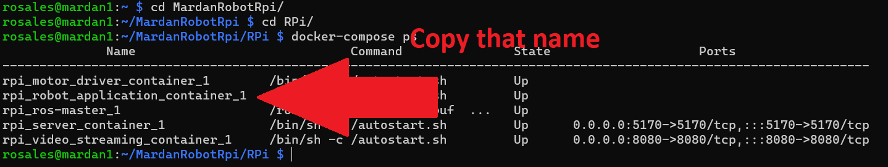
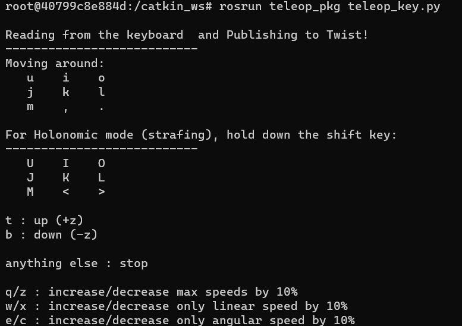

## Running teleop

To run teleop we need to move to RPi/ folder and run the next code line to visualize the Robot Applications container:

```shell
docker-compose ps
```


Then, we copy the name of the container and run the next code line:


```shell
docker exec -it ${container_name} bash
```
Now, we move to the Catkin workspace following the next path

```shell
cd catkin_ws/src/
```

When you're on the path, execute the teleop package running the next line code

```shell
rosrun teleop_pkg teleop_key.py
```
Now You can move the Mardan Robot using the keyboard.


