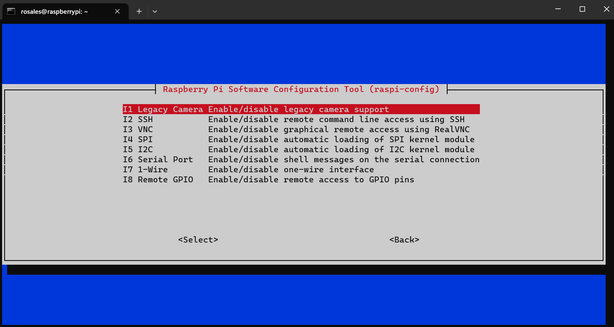

## i2c-1 - video0 errors

If you encounter errors with **i2c-1** or **video0**, such as, for example, the following: **Error: Could not open file /dev/i2c-1': No such file or directory** - **Error: Could not open file /dev/video0: No such file or directory**, please follow either of the two solutions provided below:

### Solution 1: Using raspi-config
In the terminal, use the following command  to access the Raspberry Pi Software Configuration Tool. Then, follow these steps:  
```shell
sudo raspi-config

```


1. Select option (3) Interface Options.


2.  Choose **I1 legacy Camera** if you are experiencing issues with **/dev/video0**. Or choose **I5 I2C** if your problem is related to **/dev/i2c-1**.


```shell
sudo reboot

```


### Solution 2: Modifying config.txt.
In the terminal, use the following command  to access to **config.txt**. Then, follow these steps:  
```shell
cd /boot
sudo nano config.txt
```


1. Once you're in **config.txt** , uncomment the line **dtparam=i2c_arm=on**.This will resolve the issue with **/dev/i2c-1**.


2.  Make sure that at the end of the **config.txt**, you only have the lines of code shown below.This will resolve the issue with **/dev/video0**.


3. Save the configuration by pressing **Ctrl+s** and exit by pressing **Ctrl+x** and then reboot the RPi
```shell
sudo reboot

```


