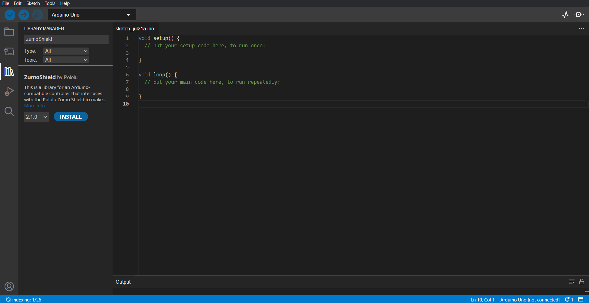
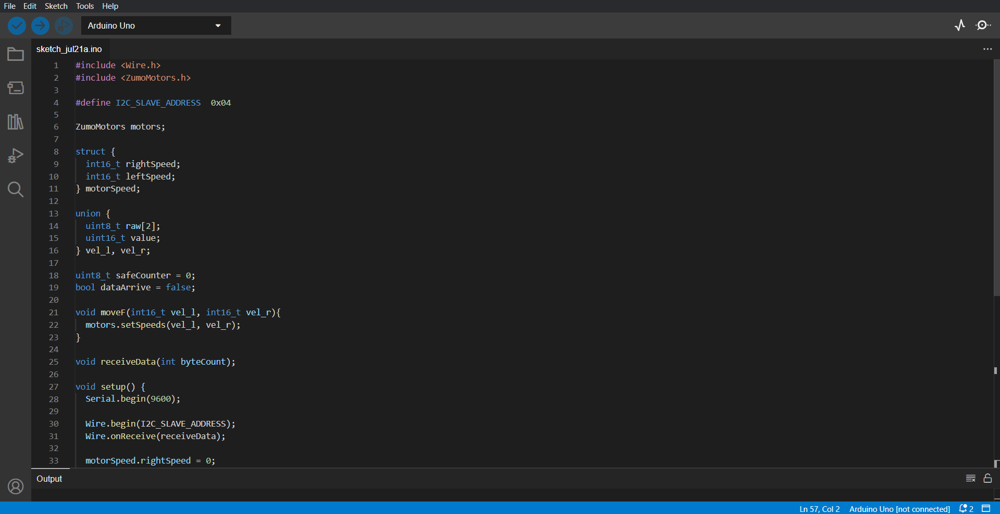
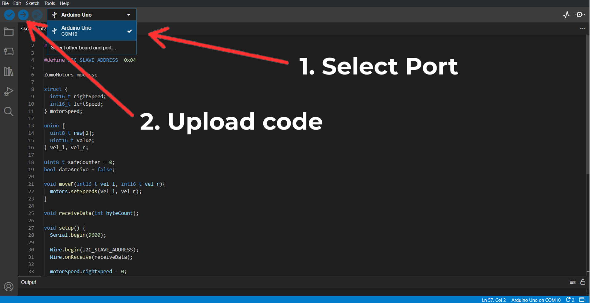

## IDE Installation


The Arduino's IDE can be downloaded from [Arduino IDE](https://www.arduino.cc/en/software).
On Arduino IDE, open the library manager tab
  

  
Then, search for ZumoShield library and press install
  

  


Download the code following next link [Arduino code](https://github.com/roboticamed/MardanRobotRpi/blob/main/ArduinoBuilder/src/i2c_motor.ino).


Import the code in the Arduino IDE
  

  
Now, select the port and upload the code
  

  
> **Note:** This guide is for Arduino Uno board.