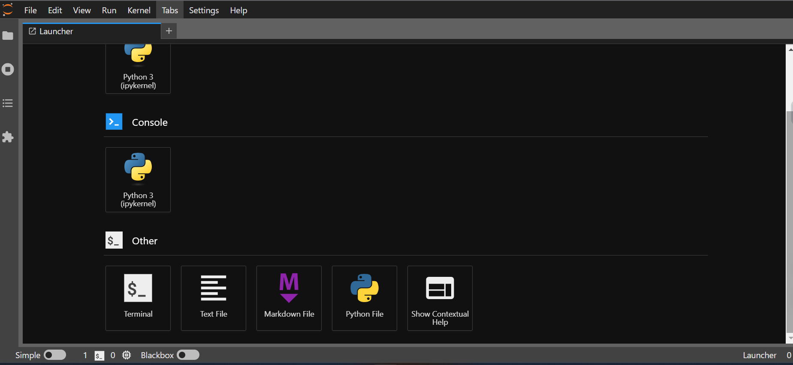

In the terminal, run the next commands.
### Connect to raspberry ssh 

```
ssh pi@hostname.local
```


### Install  python3 
```
sudo apt install python3-pip

```


### Install jupyter lab
```
sudo python3 -m pip install jupyterlab

```


This command creates a blank sheet:
```
touch ~/.jupyter/jupyter_lab_config.py

```

Create the file using nano.

command:
```
 cat jupyter_lab_config.py
```

Should display the following on the screen:
```
# Configuration file for lab.
 
c = get_config()  #noqa

c.NotebookApp.allow_origin = '*'
c.NotebookApp.ip = '0.0.0.0'
c.NotebookApp.open_browser = False

# This sha1 hash is for password: pi
c.ServerApp.password = 'argon2:$argon2id$v=19$m=10240,t=10,p=8$Fj7xenAYBXANnbsHhLT2uw$mLeEHcj9AvNHRPa1oFRyI6jBsqFc2GzvPm8v00a31Ho'
```


Run the jupyter lab command, and it should run normally
```
cd
jupyter lab
```


To make jupyterlab server available automatically from boot up, create a systemctl service to configure its launch.
```
# create the service file
sudo touch /etc/systemd/system/jupyter.service
sudo chmod 644 /etc/systemd/system/jupyter.service
```


Open an editor with sudo nano /etc/systemd/system/jupyter.service and copy/paste the following text:
>**Note** : In this guide, we don't use Ubuntu; instead, we use Pi.
```
[Unit]
Description=Jupyter Notebook

[Service]
Type=simple
ExecStart=/usr/local/bin/jupyter lab
User=pi
Group=pi
WorkingDirectory=/home/pi
Restart=always
RestartSec=10
#KillMode=mixed

[Install]
WantedBy=multi-user.target
```


The service can be controlled manually with the following commands:
```
sudo systemctl start jupyter.service 
sudo systemctl stop jupyter.service 
sudo systemctl status jupyter.service 
```


Enable the service upon system boot
```
sudo systemctl enable jupyter.service 
```

Reboot the system
```
sudo reboot
```
At the end, we should be able to enter the Jupyter Web through our server.

For example: 


When finished, something similar to this image should appear on the web.

