## OS Installation


The instructions for basic OS configuration are extracted from the [Lluvia project](https://lluvia.ai/docs/gettingstarted/installation/raspberry_pi_4/).


On the desktop machine, download the Raspberry Pi Imager and install a fresh version of the operating system in a micro SD card.

### Ubuntu Installation

```shell
sudo apt install rpi-imager

```

### Windows Installation

For Windows users, download Raspberry Pi Imager directly using this [link](https://downloads.raspberrypi.org/imager/imager_latest.exe)

### Raspberry Pi Imager

1. Select **CHOOSE OS** option to choose the Operating System.

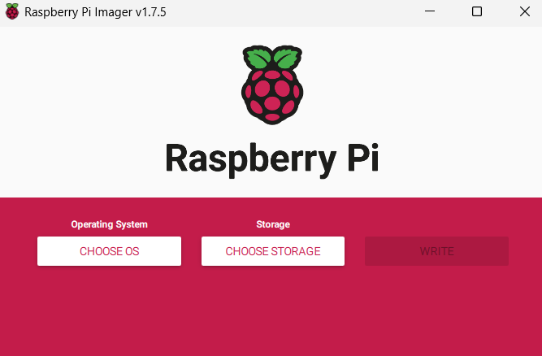


2. Select **Raspberry Pi OS Lite (64-bit)**

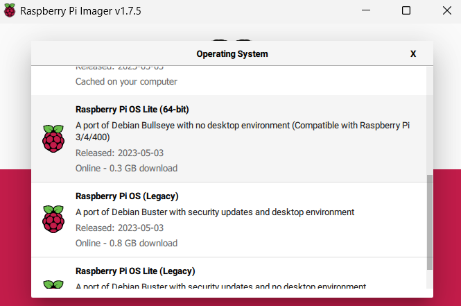

3. Inside **CHOOSE STORAGE** , select the microSD where you will install the Raspberry Pi OS.

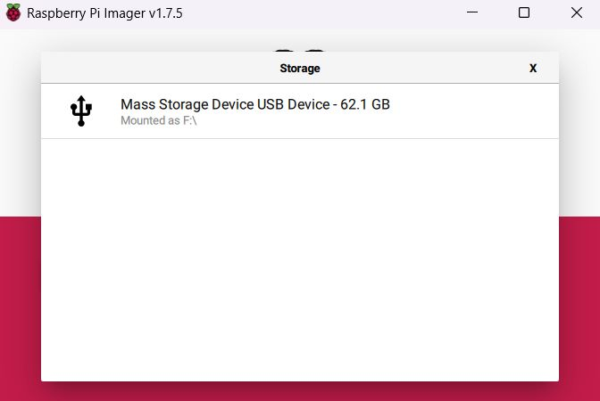

4. In the advanced  options, ensure that SSH is enabled and configure the hostname, username, password, and the Wi-Fi network to which the Raspberry Pi 4 will be connected.


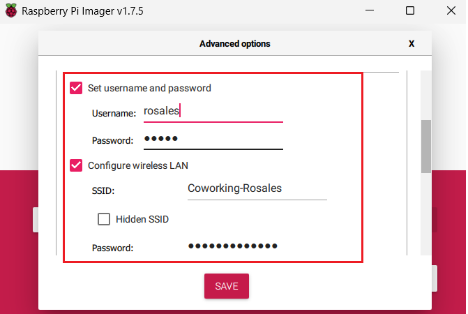

5. Click on **save**, and finally, click on **write**, and wait for the process to complete.


## Configurations inside the Raspberry Pi.


The instructions for basic OS configuration are extracted from the [Lluvia project](https://lluvia.ai/docs/gettingstarted/installation/raspberry_pi_4/).



### SSH connection 

First, insert the micro SD card into the RPi. Next, you will need to access the Raspberry terminal.There are two ways to initiate a remote connection between a PC and the Raspberry Pi using the SSH protocol. To get started, ensure that both devices are connected to the same network,and then,to enable remote access to the Raspberry terminal, you need to execute either of the two following methods from the PC's terminal. If the process is successful, you will gain remote access to the Raspberry terminal.

Both the username and hostname, as well as the password, set during the initial OS installation of the Raspberry Pi will be required.


###### **Using the Raspberry's hostname** 

```shell
ssh username@hostname.local
```

For example: 

```shell
ssh rosales@raspberrypi.local
```

###### **Using the Raspberry's IP** 
```shell
ssh username@raspberry_ip

```
For example: 
```shell
ssh rosales@192.168.1.77
```

>**Note** - You can obtain the IP of the Raspberry Pi using the following command:

```shell
sudo ifconfig
```

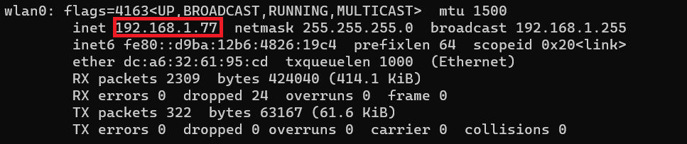

After gaining access to the Raspberry terminal, proceed to update and upgrade the operating system.

```shell
sudo apt update
sudo apt upgrade

sudo reboot
```


### Expand storage

```shell
sudo raspi-config
```

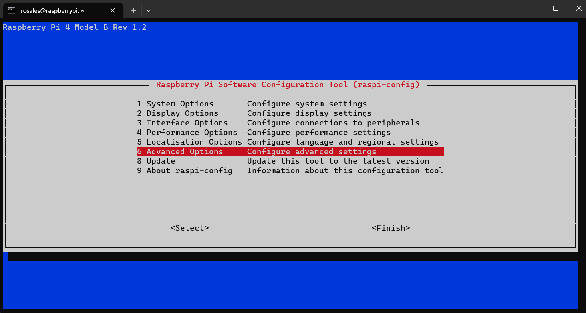

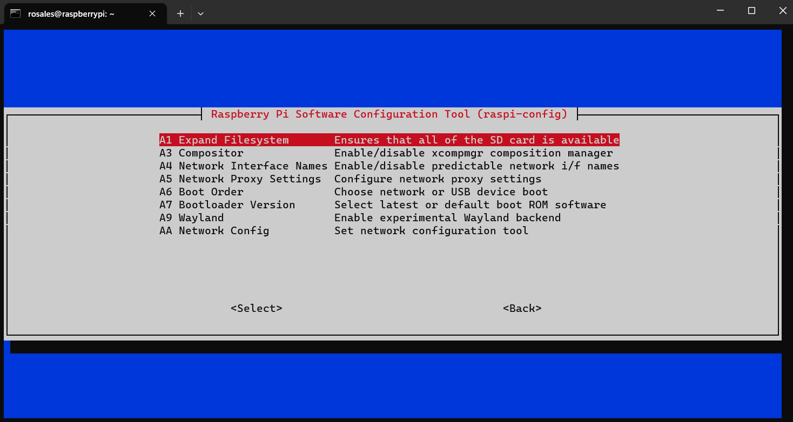

```shell
sudo reboot
```

### Camera module

If you have a camera module available, you can enable it by following the [official guide](https://www.raspberrypi.com/documentation/accessories/camera.html)

```shell
sudo raspi-config
```

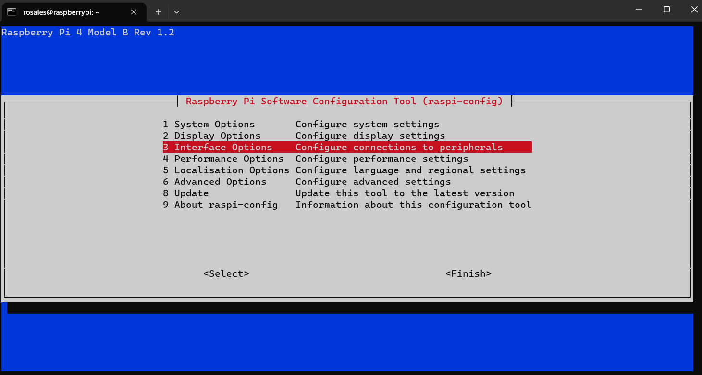


```shell
sudo reboot
```

### I2C module
```shell
sudo raspi-config
```


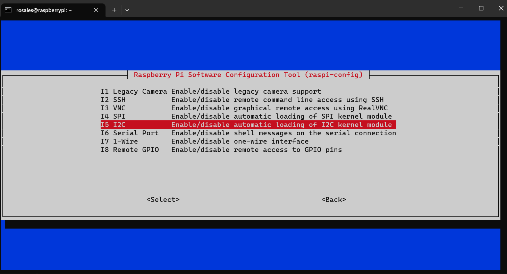

```shell
sudo reboot
```

## Docker


The instructions here provided are extracted from [Simplelearn](https://www.simplilearn.com/tutorials/docker-tutorial/raspberry-pi-docker). The official instruction avaiable at [Docker.com](https://docs.docker.com/engine/install/raspbian/) did not work at the time of writing this guide.


In the Raspberry terminal, run:


```bash
curl -fsSL https://get.docker.com -o get-docker.sh
sudo sh get-docker.sh

# Grant priviledges to the Rpi4 Username  that was set during the extra setting Raspberry Pi,to run docker containers
sudo usermod -aG docker ${RPi4_USERNAME}

#Project dependencies and Docker compose
sudo apt-get install -y libffi-dev libssl-dev python3-dev python3 python3-pip

sudo pip3 install docker-compose

sudo systemctl enable docker

# restart the Raspberry
sudo reboot
```

Once logged in, try running the following commands:

```bash
docker version
```

That should give an output similar to:

```
Client: Docker Engine - Community
 Version:           24.0.4
 API version:       1.43
 Go version:        go1.20.5
 Git commit:        3713ee1
 Built:             Fri Jul  7 14:50:52 2023
 OS/Arch:           linux/arm64
 Context:           default

Server: Docker Engine - Community
 Engine:
  Version:          24.0.4
  API version:      1.43 (minimum version 1.12)
  Go version:       go1.20.5
  Git commit:       4ffc614
  Built:            Fri Jul  7 14:50:52 2023
  OS/Arch:          linux/arm64
  Experimental:     false
 containerd:
  Version:          1.6.21
  GitCommit:        3dce8eb055cbb6872793272b4f20ed16117344f8
 runc:
  Version:          1.1.7
  GitCommit:        v1.1.7-0-g860f061
 docker-init:
  Version:          0.19.0
  GitCommit:        de40ad0
```

and run a demo container:

```bash
docker run hello-world
```

Which should output some text like this:

```
Hello from Docker!
This message shows that your installation appears to be working correctly.

To generate this message, Docker took the following steps:
 1. The Docker client contacted the Docker daemon.
 2. The Docker daemon pulled the "hello-world" image from the Docker Hub.
    (arm64v8)
 3. The Docker daemon created a new container from that image which runs the
    executable that produces the output you are currently reading.
 4. The Docker daemon streamed that output to the Docker client, which sent it
    to your terminal.

To try something more ambitious, you can run an Ubuntu container with:
 $ docker run -it ubuntu bash

Share images, automate workflows, and more with a free Docker ID:
 https://hub.docker.com/

For more examples and ideas, visit:
 https://docs.docker.com/get-started/
```

## Troubleshooting


The instructions here provided are solutions to potential errors that may occur during the RPi4 setup


### **i2c-1 - video0 errors**

If you encounter errors with **i2c-1** or **video0**, such as, for example, the following: **Error: Could not open file /dev/i2c-1': No such file or directory** - **Error: Could not open file /dev/video0: No such file or directory**, please follow either of the two solutions provided below:

### Solution 1: Using raspi-config

In the terminal, use the following command  to access the Raspberry Pi Software Configuration Tool. Then, follow these steps:

```shell
sudo raspi-config

```


1. Select option (3) Interface Options.


2.  Choose **I1 legacy Camera** if you are experiencing issues with **/dev/video0**. Or choose **I5 I2C** if your problem is related to **/dev/i2c-1**.


```shell
sudo reboot

```


### Solution 2: Modifying config.txt.

In the terminal, use the following command  to access to **config.txt**. Then, follow these steps:

```shell
cd /boot
sudo nano config.txt
```


1. Once you're in **config.txt** , uncomment the line **dtparam=i2c_arm=on**.This will resolve the issue with **/dev/i2c-1**.

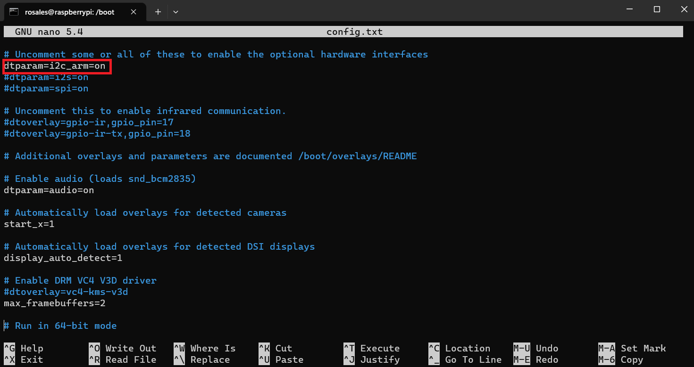


2.  Make sure that at the end of the **config.txt**, you only have the lines of code shown below.This will resolve the issue with **/dev/video0**.

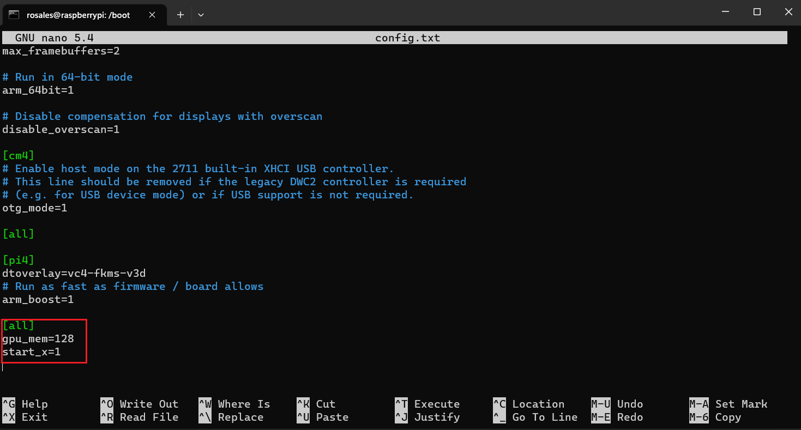


3. Save the configuration by pressing **Ctrl+s** and exit by pressing **Ctrl+x** and then reboot the RPi

```shell
sudo reboot

```


